# Neo4j KN-N-02: Datenabfrage und -Manipulation

## A) Daten hinzufügen (20%)

### Beschreibung
In diesem Schritt wurde eine sinnvolle Menge an Knoten und Kanten hinzugefügt. Es wurden Schüler, Lehrer, Klassen und Module erstellt sowie deren Beziehungen definiert. 

### Cypher-Skript
Das vollständige Cypher-Skript zur Datenerstellung ist in der Datei `neo4j_kn02_script.cypher` enthalten.

### Screenshot
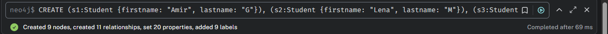

---
## B) Daten abfragen (20%)

### Erklärung des Statements zur Abfrage aller Knoten und Kanten
Das folgende Statement listet alle vorhandenen Knoten und deren Beziehungen auf:
```cypher
MATCH (n)-[r]->(m) RETURN n,r,m;
```
Es sucht alle Knoten `n` und `m`, die durch eine Beziehung `r` miteinander verbunden sind, und gibt sie zurück.

Die `OPTIONAL MATCH`-Klausel ist eine spezielle Form der Abfrage, die auch dann Ergebnisse zurückliefert, wenn die gesuchte Beziehung nicht existiert. Zum Beispiel:
```cypher
MATCH (s:Student)
OPTIONAL MATCH (s)-[h:HAT_NOTE]->(m:Modul)
RETURN s, h, m;
```
Falls ein Student keine Note in einem Modul hat, wird dennoch der Student zurückgegeben, jedoch mit `NULL`-Werten für `h` und `m`.

### Szenarien und Abfragen
#### 1. Alle Studenten mit einer Note größer als 5
```cypher
MATCH (s:Student)-[h:HAT_NOTE]->(m:Modul)
WHERE h.wert > 5
RETURN s, h, m;
```
#### 2. Lehrer und deren unterrichtete Module
```cypher
MATCH (t:Teacher)-[:UNTERRICHTET_MODUL]->(m:Modul)
RETURN t.firstname, t.lastname, m.name;
```
#### 3. Alle Studenten und deren Noten (auch ohne Noten)
```cypher
MATCH (s:Student)
OPTIONAL MATCH (s)-[h:HAT_NOTE]->(m:Modul)
RETURN s, h, m;
```
#### 4. Anzahl der Schüler pro Klasse
```cypher
MATCH (k:Klasse)<-[:IST_IN_DER_KLASSE]-(s:Student)
RETURN k.name, COUNT(s) AS Anzahl_Schüler;
```

### Screenshot
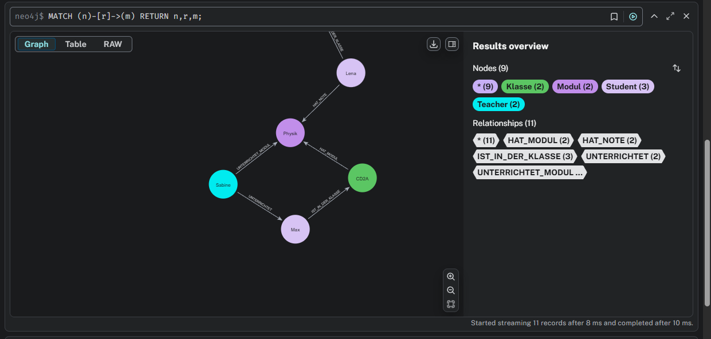

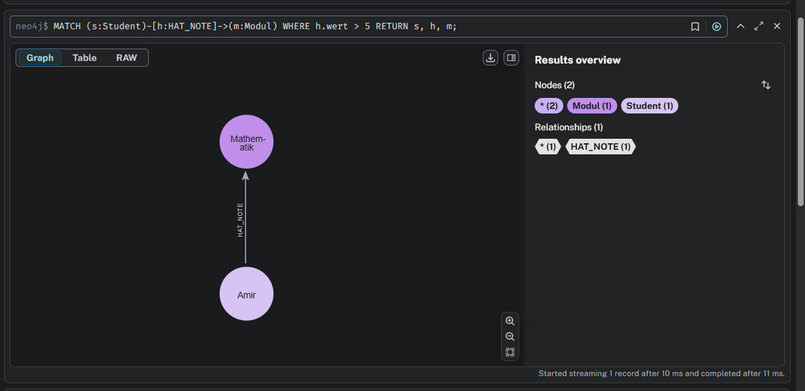

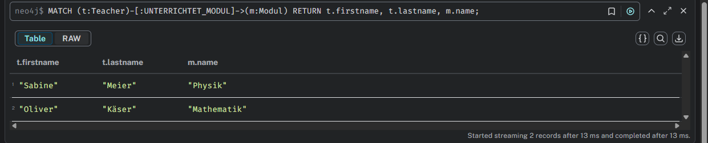

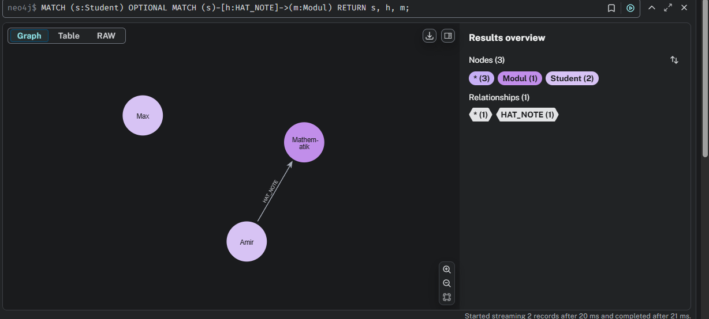
---
## C) Daten löschen (20%)

### Ohne DETACH DELETE
```cypher
MATCH (s:Student {firstname: "Amir", lastname: "G"})
DELETE s;
```
Hierbei wird nur der Knoten gelöscht, aber nicht die Beziehungen. Falls noch bestehende Beziehungen existieren, tritt ein Fehler auf.

### Mit DETACH DELETE
```cypher
MATCH (s:Student {firstname: "Lena", lastname: "M"})
DETACH DELETE s;
```
Hierbei wird der Knoten samt aller zugehörigen Beziehungen gelöscht.

### Screenshots
Vorher:


Nachher (ohne DETACH):
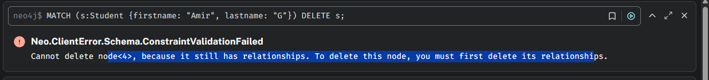

Nachher (mit DETACH):
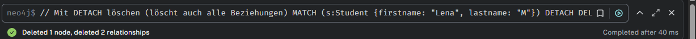

---
## D) Daten verändern (20%)

### Szenarien und Abfragen
#### 1. Note eines Schülers aktualisieren
```cypher
MATCH (s:Student {firstname: "Amir", lastname: "G"})-[h:HAT_NOTE]->(m:Modul {name: "Mathematik"})
SET h.wert = 6.0;
```
#### 2. Modulbeschreibung ändern
```cypher
MATCH (m:Modul {name: "Physik"})
SET m.description = "Thermodynamik";
```
#### 3. Schüler in eine andere Klasse verschieben
```cypher
MATCH (s:Student {firstname: "Max", lastname: "T"})-[r:IST_IN_DER_KLASSE]->(k:Klasse)
DELETE r
WITH s
MATCH (k2:Klasse {name: "AB1B"})
CREATE (s)-[:IST_IN_DER_KLASSE]->(k2);
```

### Screenshot
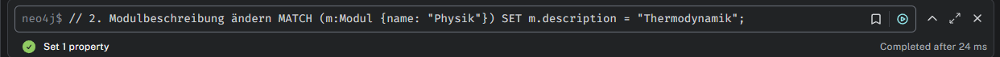

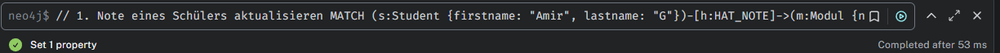

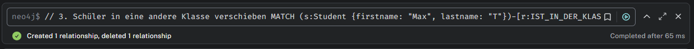

---
## E) Zusätzliche Klauseln (20%)

### 1. Nutzung von COLLECT
Diese Klausel sammelt Werte aus einer Abfrage in eine Liste:
```cypher
MATCH (k:Klasse)-[:HAT_MODUL]->(m:Modul)
RETURN k.name, COLLECT(m.name) AS Module;
```
Diese Abfrage gibt alle Module einer Klasse in Listenform zurück.

### 2. Nutzung von COUNT
Diese Klausel zählt die Anzahl der gefundenen Knoten:
```cypher
MATCH (k:Klasse)<-[:IST_IN_DER_KLASSE]-(s:Student)
RETURN k.name, COUNT(s) AS Anzahl_Schüler;
```
Hier wird die Anzahl der Schüler pro Klasse ermittelt.

### Screenshot
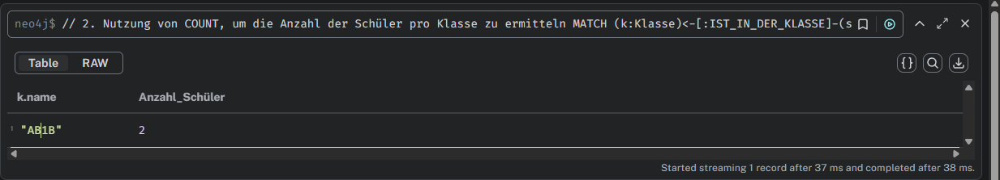

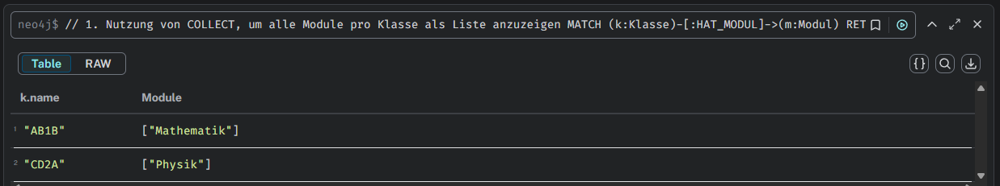

---
## Fazit
In dieser Abgabe wurde eine komplette Neo4j-Datenbank mit einer Beispielwelt erstellt, verschiedene Abfragen durchgeführt, Daten verändert und gelöscht sowie zusätzliche Cypher-Klauseln genutzt. Die Screenshots dokumentieren die erfolgreiche Durchführung aller Schritte.
