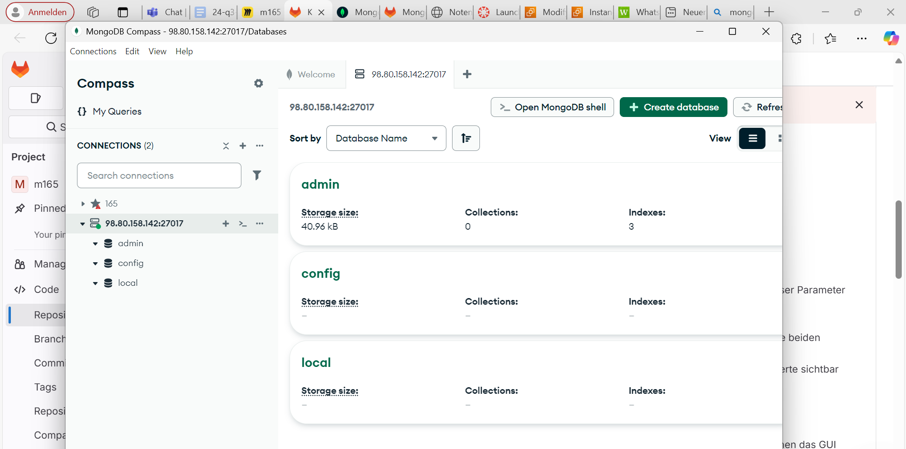
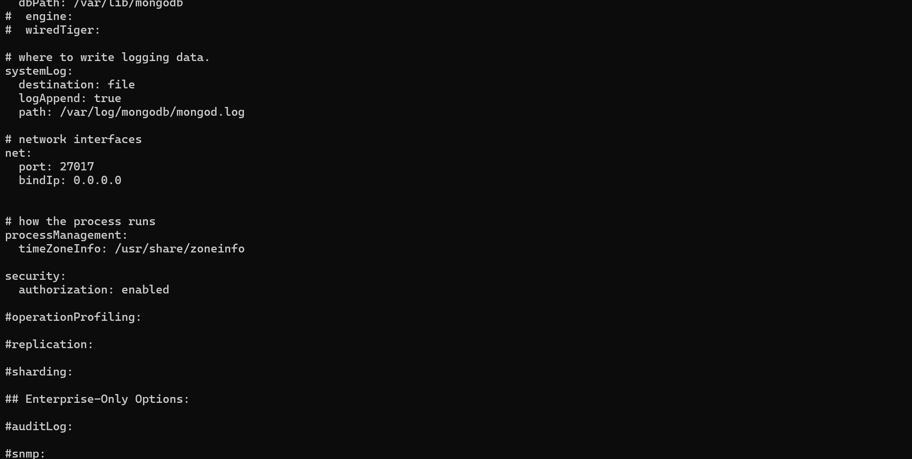
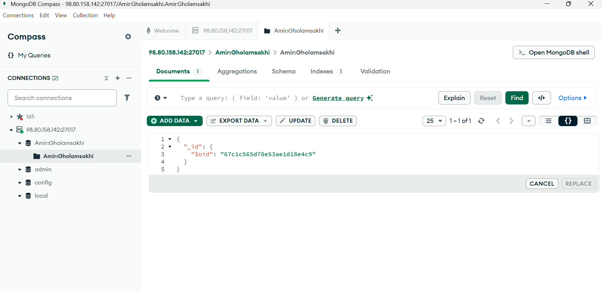
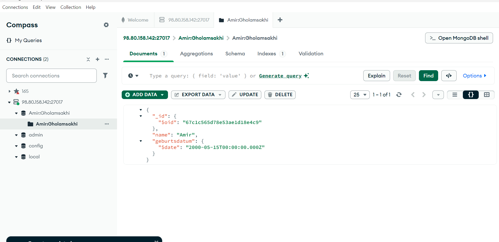
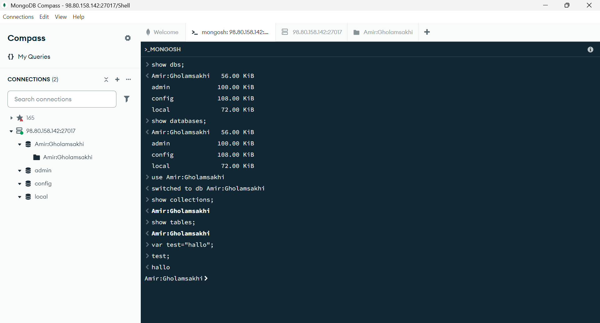
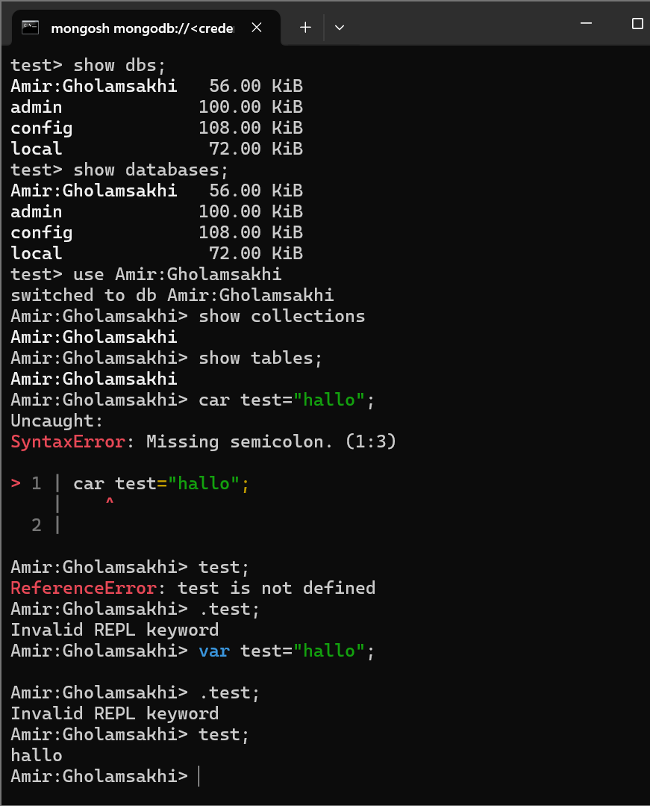

**Aufgabe A**

**Screenshot von Compass mit der Liste der bereits bestehenden Datenbanken.**

**Schauen Sie sich Ihren Connection String an. Erklären Sie was die Option authSource=admin macht und wieso dieser Parameter so korrekt ist.**
- mongodb://<IhrBenutzer>:<IhrPasswort>@<IhreIp>:27017/?authSource=admin&readPreference=primary&ssl=false

1. IhrPasswort → Anmeldedaten für die Authentifizierung.
2. IhreIp:27017 → IP-Adresse des MongoDB-Servers und Standardport (27017).
3. authSource=admin → Gibt an, dass die Authentifizierung über die admin-Datenbank erfolgt.
4. readPreference=primary → Lesezugriffe erfolgen auf das primäre Replikat (falls Replikation aktiv ist).
5. ssl=false → Deaktiviert SSL-Verschlüsselung (wenn keine SSL-Verbindung genutzt wird).

Der Befehl stellt eine Verbindung zu einer MongoDB-Datenbank her, authentifiziert den Benutzer über die Admin-Datenbank und deaktiviert SSL.

**Erklären Sie was die beiden Befehle bewirken. (Schauen Sie in den Quellen nach). Sie sollen erklären wieso die beiden Befehle notwendig sind, resp. was der Einfluss auf unsere MongoDB ist.**
 - sudo sed -i 's/#security:/security:\n  authorization: enabled/g' /etc/mongod.conf

    1. sudo: Befehl als 
    2. sed: stream editor sed um die Datei zu bearbeiten
    3. i: in place, datei wird direkt überschrieben, keine neue Datei
    4. 's/#security:/security:\n authorization: enabled/g'
        1. erstes s ist substitute
        2. #security wird gesucht
        3. security:\n authorization: macht den Security Abschnitt aktiv
        4. g: global, damit wird alles in der Datei ersetzt, nicht nur die erste

Aktiviert die Benutzerauthentifizierung in MongoDB, sodass nur registrierte Benutzer mit den richtigen Berechtigungen auf die Datenbank zugreifen können.

 - sudo sed -i 's/127.0.0.1/0.0.0.0/g' /etc/mongod.conf
    1. s/127.0.0.1: nur lokale Verbindungen sind möglich
    2. 0.0.0.0 von allen Netzwerken Verbindung
    3. /etc/mongod.conf: Datei in der die Änderungen vorgenommen werden 

 Ändert die Bind-IP von 127.0.0.1 (lokaler Zugriff) auf 0.0.0.0, sodass MongoDB von externen Servern erreichbar ist.

 **Zeigen Sie mit einem Screenshot den Inhalt der MongoDB Konfigurations-Datei in dem die beiden ersetzten Werte sichtbar sind. Sie können die Datei z.B. mit nano öffnen oder mit cat den Inhalt anzeigen lassen und mit grep filtern.**
 Diese wurden beide verändern
 port: 27017, bindIp: 0.0.0.0 
 

**Aufgabe B**
 **Screenshot (oder JSON) Ihres einzufügenden Dokuments (bevor Sie es einfügen)**
 

 Um das Datum direkt korrekt einzufügen, hätte man es in JSON als "$date"-Wert im ISO 8601-Format speichern müssen:

**Screenshot Ihrer Compass-Applikation mit der Datenbank, Collection und Dokument sichtbar, nachdem Sie den Datentyp geändert haben.**
 

**Export-Datei und Erklärung zu dem Datentyp mit möglichen Implikationen auf andere Datentypen. Wieso ist dieser komplizierte Weg notwendig, um ein Datum zu definieren?**

MongoDB speichert Daten im BSON-Format (Binary JSON).
Das Standard-JSON-Format kennt jedoch keine expliziten Datumswerte – es speichert sie als String.
Ohne $date wird das Datum als String gespeichert:

**Aufgabe C**
**creenshot von Compass, der zeigt, dass Sie die Befehle eingegeben haben**
MOnogosh Commands

**Screenshot von der MongoDB-Shell auf dem Linux-Server, der zeigt, dass Sie die Befehle eingegeben haben.**
Selben Commands im CMD

**Was machen die Befehle 1-5? Was ist der Unterschied zwischen Collections und Tables?**
Befehle 1-5 erklärt
1. show dbs; 
Zeigt alle vorhandenen Datenbanken.
2. show databases;  
Macht dasselbe wie show dbs;.
3. use Ihre-Datenbank; 
Wechselt zur angegebenen Datenbank. Falls sie nicht existiert, wird sie erst nach dem Speichern eines Dokuments erstellt.
4. show collections; 
Zeigt alle Collections (Tabellen-Äquivalente) in der aktuellen Datenbank.
5. show tables;  Ist ein Alias für show collections;, gibt also dasselbe Ergebnis aus.

**Unterschied tables und collections**
Collections in MongoDB sind schemafrei und speichern JSON/BSON-Dokumente, während Tables in SQL-Datenbanken eine feste Struktur mit Zeilen und Spalten haben.

um in diesen Test ordner vom MongoDB im CMD rein zu kommen musst du die SSH-Key benutzen von der Instanz
ssh -i "165.pem" ubuntu@ec2-98-80-158-142.compute-1.amazonaws.com
danach kannst du den command benutzen sudo mongosh --authenticationDatabase "admin" -u "uname" -p "password"