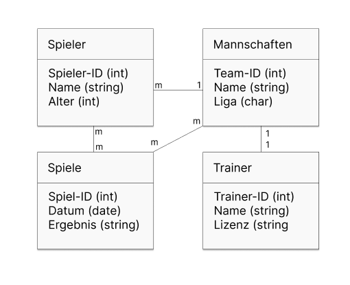
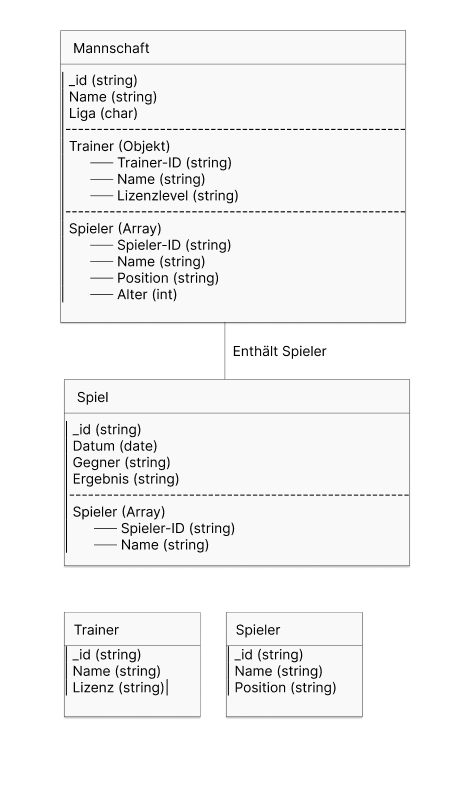

# A) Konzeptionelles Datenmodell

Spieler sind mit Mannschaften verknüpft (m:1) 
→ Jeder Spieler gehört genau einer Mannschaft, aber eine Mannschaft kann mehrere Spieler haben.

Mannschaften sind mit Spielen verknüpft (m:n) 
→ Ein Spiel besteht aus mehreren Mannschaften, und jede Mannschaft nimmt an mehreren Spielen teil.

Spieler sind mit Spielen verknüpft (m:n) 
→ Ein Spieler kann an mehreren Spielen teilnehmen, und ein Spiel kann mehrere Spieler beinhalten.

Trainer sind mit Mannschaften verknüpft (1:1) 
→ Jede Mannschaft hat genau einen Trainer, und jeder Trainer trainiert genau eine Mannschaft.

### Wie funktioniert das relational?
Die Spieler-Tabelle speichert alle Spieler und verweist mit Team-ID auf die Mannschaften-Tabelle.
Die Mannschaften-Tabelle enthält eine Referenz auf die Trainer-Tabelle über Trainer-ID.
Die Spiele-Tabelle verbindet Mannschaften über eine m:n-Beziehung (d. h. es gibt eine Zwischentabelle, um Mannschaften und Spiele zu verknüpfen).
Die Spieler werden ebenfalls über eine m:n-Beziehung mit Spielen verknüpft.

# B) Logisches Modell für MongoDB
Mannschaften enthalten Spieler und Trainer (eingebettete Dokumente) 
→ Statt separate Tabellen zu haben, speichert jedes Mannschafts-Dokument eine Liste von Spielern sowie das Trainer-Objekt direkt innerhalb des Dokuments.

Spiele enthalten eine Liste von Spielern 
→ Jedes Spiel-Dokument speichert eine Liste der teilnehmenden Spieler mit Spieler-ID und Name.

Trainer und Spieler können auch als separate Dokumente existierenybr
→ Falls nötig, können Spieler und Trainer als separate Dokumente gespeichert werden, um sie unabhängig von einer Mannschaft zu verwalten.

### Wie funktioniert das dokumentenorientiert?
Eine Mannschaft speichert direkt alle ihre Spieler in einem Array.
Der Trainer ist als eingebettetes Objekt in der Mannschaft gespeichert.
Ein Spiel speichert die IDs der Spieler, die daran teilnehmen.  

# C) Anwendung des Schemas in MongoDB 
