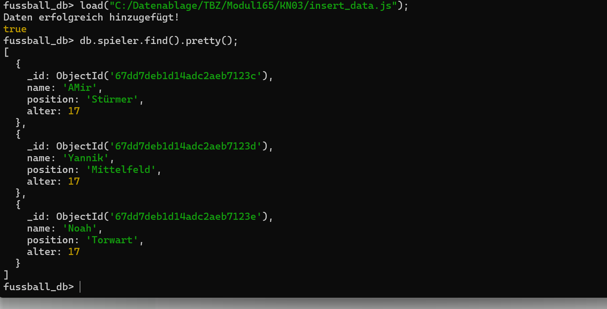
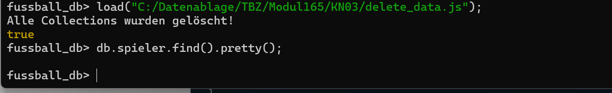
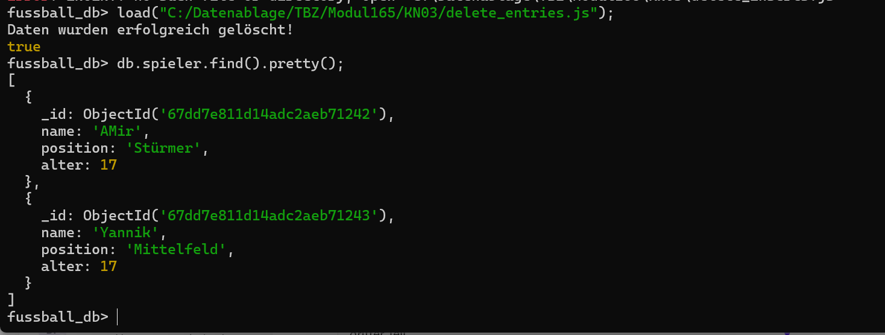
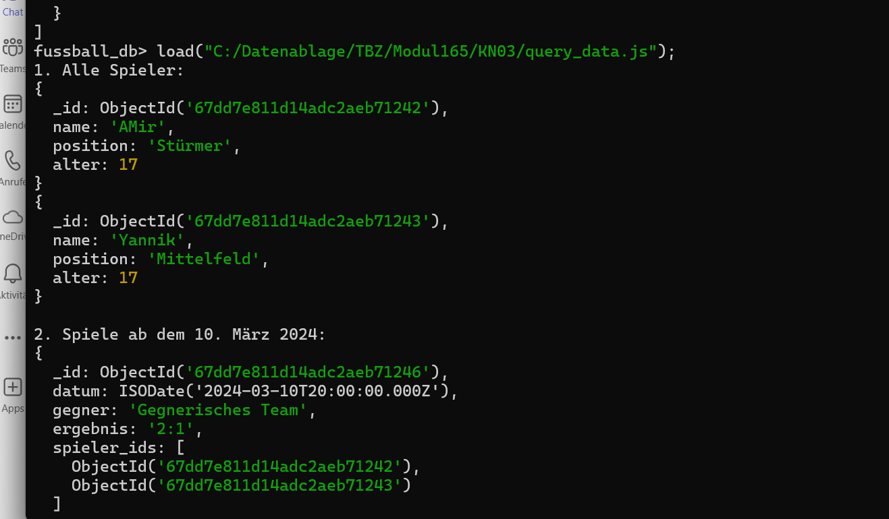
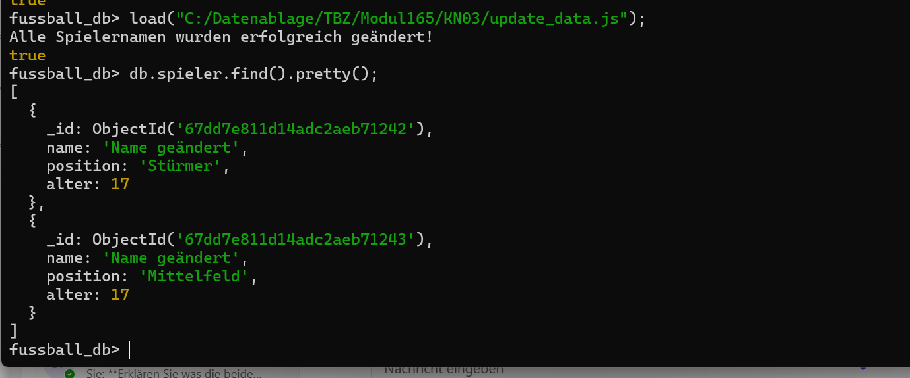

# Dokumentation der MongoDB Abgaben

## A) Daten hinzufügen (25%)

### Beschreibung
In diesem Schritt wurden für jede Collection 3-5 Datensätze hinzugefügt. Dabei wurden:
- ObjectId-Variablen zur Identifikation der Datensätze verwendet.
- `insertOne()` für mindestens eine Collection genutzt.
- `insertMany()` für mindestens eine Collection genutzt.

### Skript
```javascript
// Verbindung zur Datenbank

//DIESEN COMMAND SELBSTÄNDIG IN MONGOSH EINFÜGEN
// use fussball_db;

// ObjectIds als Variablen
let spieler1 = ObjectId();
let spieler2 = ObjectId();
let spieler3 = ObjectId();
let mannschaft1 = ObjectId();
let spiel1 = ObjectId();
let trainer1 = ObjectId();

// Spieler einfügen (insertMany)
db.spieler.insertMany([
    { _id: spieler1, name: "Amir", position: "Stürmer", alter: 17 },
    { _id: spieler2, name: "Yannik", position: "Mittelfeld", alter: 17 },
    { _id: spieler3, name: "Noah", position: "Torwart", alter: 17 }
]);

// Mannschaft einfügen (insertOne)
db.mannschaften.insertOne({
    _id: mannschaft1,
    name: "TBZBallers",
    liga: "Kreisliga",
    trainer_id: trainer1,
    spieler: [spieler1, spieler2, spieler3]
});

// Trainer einfügen (insertOne)
db.trainer.insertOne({
    _id: trainer1,
    name: "Trainer",
    lizenzlevel: "Gut"
});

// Spiel einfügen (insertOne)
db.spiele.insertOne({
    _id: spiel1,
    datum: ISODate("2024-03-10T20:00:00Z"),
    gegner: "Gegnerisches Team",
    ergebnis: "2:1",
    spieler_ids: [spieler1, spieler2]
});

print("Daten erfolgreich hinzugefügt!");
```
## Screenshot | Hinzufügen der Dateb


---

## B) Daten löschen (25%)

### Skript zum Löschen aller Collections
```javascript
// Verbindung zur Datenbank

//DIESEN COMMAND SELBSTÄNDIG IN MONGOSH EINFÜGEN
// use fussball_db;

// Alle Collections löschen
db.spieler.drop();
db.mannschaften.drop();
db.trainer.drop();
db.spiele.drop();

print("Alle Collections wurden gelöscht!");
```

### Skript zum teilweisen Löschen von Daten
```javascript
// Verbindung zur Datenbank

//DIESEN COMMAND SELBSTÄNDIG IN MONGOSH EINFÜGEN
// use fussball_db;

// Einzelnen Spieler löschen mit deleteOne()
db.spieler.deleteOne({ name: "Noah" });

// Mehrere Spieler löschen mit deleteMany() (ODER-Verknüpfung)
db.spieler.deleteMany({
    $or: [{ alter: { $lt: 17 } }, { position: "Torwart" }]
});

print("Daten wurden erfolgreich gelöscht!");
```
## Screenshot | Löschung aller Collections

## Screenshot | Löschung aller Daten


---

## C) Daten abfragen (25%)

### Skript
```javascript
// Verbindung zur Datenbank

//DIESEN COMMAND SELBSTÄNDIG IN MONGOSH EINFÜGEN
// use fussball_db;

// 1. Alle Spieler anzeigen
db.spieler.find();

// 2. Abfrage mit DateTime-Feld (Spiel nach Datum filtern)
db.spiele.find({ datum: { $gte: ISODate("2024-03-01T00:00:00Z") } });

// 3. ODER-Verknüpfung (Spieler mit bestimmter Position oder Alter)
db.spieler.find({
    $or: [{ position: "Mittelfeld" }, { alter: { $lt: 17 } }]
});

// 4. UND-Verknüpfung (Mannschaften mit bestimmter Liga & Trainer-ID)
db.mannschaften.find({
    $and: [{ liga: "La Liga" }, { trainer_id: { $exists: true } }]
});

// 5. Regex-Abfrage (Suche nach Spielernamen mit "Luca")
db.spieler.find({ name: { $regex: "Luca", $options: "i" } });

// 6. Projektion mit _id
db.spieler.find({}, { name: 1, position: 1, _id: 1 });

// 7. Projektion ohne _id
db.spieler.find({}, { name: 1, position: 1, _id: 0 });

print("Abfragen erfolgreich ausgeführt!");
```
## Screenshot | Abfragen der Daten


---

## D) Daten verändern (25%)

### Skript
```javascript
// use fussball_db vorher manuell ausführen

// Setzt bei allen Spielern den Namen auf "Name geändert"
db.spieler.updateMany({}, { $set: { name: "Name geändert" } });

print("Alle Spielernamen wurden erfolgreich geändert!");
```
## Screenshot | Ändern bestimmter Daten


---

## Fazit
Diese Abgaben zeigen, wie Daten in MongoDB eingefügt, gelöscht, abgefragt und verändert werden. Alle Aufgaben wurden erfolgreich ausgeführt und dokumentiert.

